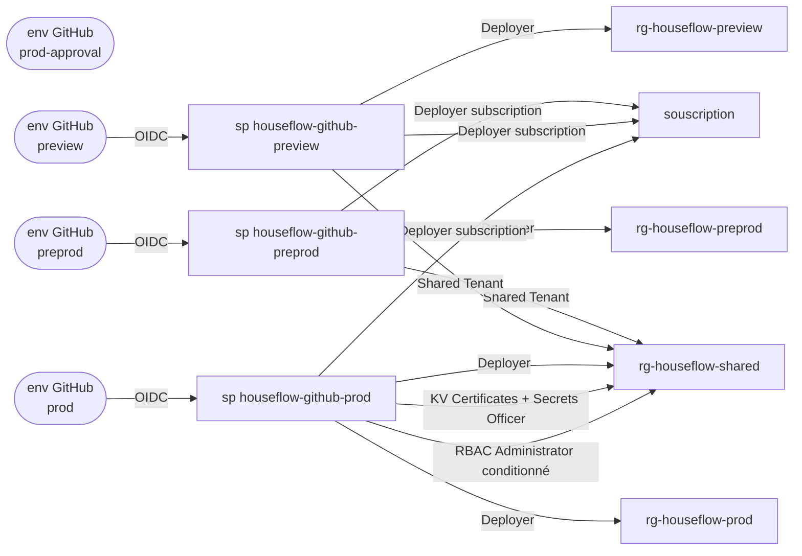

# RBAC HouseFlow — qui a le droit de faire quoi, et où

Une frontière = une identité. Chaque environnement GitHub applicatif a sa propre app registration
Entra, donc son propre service principal, donc ses propres droits. Un run preprod ne peut rien
écrire dans `rg-houseflow-prod`, et réciproquement.

Deux mécanismes à ne pas confondre :

- **Federated credential** = une *confiance*. Elle dit quel workflow GitHub peut demander un token
  au nom de cette identité (subject `repo:BarbeRouss/HouseFlow:environment:<env>`). Elle ne donne
  accès à aucune ressource.
- **Role assignment** = un *droit*. Il est posé sur le service principal, à un scope donné.

C'est pourquoi `prod-approval` n'a **ni** app registration **ni** federated credential : c'est une
gate d'approbation humaine, elle n'accède à rien.

## Vue d'ensemble



`prod-approval` n'a aucune flèche : aucune identité, aucun droit, rien qu'une approbation requise.

## Rôles par scope

| Scope | `sp-preprod` | `sp-preview` | `sp-prod` |
|---|---|---|---|
| `rg-houseflow-preprod` | **Deployer** | — | — |
| `rg-houseflow-preview` | — | **Deployer** | — |
| `rg-houseflow-prod` | — | — | **Deployer** |
| `rg-houseflow-shared` | **Shared Tenant** | **Shared Tenant** | **Deployer** + `Key Vault Certificates Officer` + `Key Vault Secrets Officer` + `Role Based Access Control Administrator` (conditionné) |
| souscription | **Deployer (subscription)** | **Deployer (subscription)** | **Deployer (subscription)** |

Le rôle souscription est le seul droit hors resource group : `Microsoft.Web/locations/*/read`, pour
lire l'état des opérations longues des Static Web Apps lors de la liaison d'un domaine custom —
qu'Azure publie hors resource group. Seul `sp-preview` en a besoin aujourd'hui (les previews servent
leur frontend par Static Web App, preprod et prod par Container App) ; il est assigné aux trois
parce que #212 fera passer preprod et prod aux Static Web Apps. Il est en lecture seule.

## Ce que contient chaque rôle custom

Définitions versionnées ici même — ces fichiers sont la source de vérité, le tableau n'en est qu'un
résumé.

### `HouseFlow Deployer` — `houseflow-deployer.role.json`

Plan de gestion de tout ce que Terraform crée dans un resource group HouseFlow.

| Domaine | Actions |
|---|---|
| Container Apps | `Microsoft.App/*` (apps, environnements, **jobs**, certificats d'environnement) |
| Static Web Apps | `Microsoft.Web/staticSites/*` |
| PostgreSQL | `Microsoft.DBforPostgreSQL/flexibleServers/*` |
| Observabilité | `Microsoft.OperationalInsights/workspaces/*` |
| Réseau | `Microsoft.Network/virtualNetworks/*`, `privateDnsZones/*`, `networkSecurityGroups/*` |
| Identité | `Microsoft.ManagedIdentity/userAssignedIdentities/*` |
| Key Vault | `vaults/read`, `vaults/write`, `vaults/delete` — **plan de gestion uniquement** |
| Storage | `storageAccounts/read`, `listKeys/action`, `blobServices/containers/*` |
| Divers | `resourceGroups/read`, `deployments/*`, `Authorization/locks/*` |

Pas de `Microsoft.Authorization/roleAssignments/write` : un deployer ne peut pas s'octroyer de
droits. Les rôles data-plane sont posés par le stack `shared`, avec le rôle conditionné ci-dessous.

### `HouseFlow Shared Tenant` — `houseflow-shared-tenant.role.json`

Ce qu'un environnement **non-prod** a le droit de faire dans `rg-houseflow-shared`, et rien d'autre.
Strictement ce dont son stack `env` a besoin pour se raccorder à la base partagée :

| Besoin | Actions |
|---|---|
| Peerer son VNet vers `vnet-houseflow-shared` | `virtualNetworks/read`, `virtualNetworks/peer/action`, `virtualNetworkPeerings/{read,write,delete}` |
| Résoudre le FQDN privé du serveur | `privateDnsZones/read`, `privateDnsZones/virtualNetworkLinks/{read,write,delete}` |
| Attacher son identité managée à ses apps | `userAssignedIdentities/read`, `userAssignedIdentities/assign/action` |
| Lire les ressources partagées | `flexibleServers/read`, `vaults/read`, `storageAccounts/read`, `blobServices/containers/read` |

Aucune écriture sur le serveur PostgreSQL, le Key Vault ou le storage account. Les bases non-prod
ne sont pas créées par ARM mais en SQL, par les jobs `dbtools`, avec l'identité de l'environnement.

### `HouseFlow Deployer (subscription)` — `houseflow-deployer-subscription.role.json`

`Microsoft.Web/locations/*/read`, et rien d'autre. Le wildcard est délibéré : l'action exacte
(`staticSitesOperationStatuses/read`) n'est pas publiée dans le registre du provider, et
`az role definition create` la refuse.

La création des Static Web Apps elles-mêmes relève du rôle `HouseFlow Deployer`
(`Microsoft.Web/staticSites/*`), dans le resource group de l'environnement — rien à changer côté
rôles le jour où preprod et prod y passeront.

## Rôles data-plane — posés par Terraform, pas au bootstrap

Le stack `shared` assigne ces rôles aux **identités managées** (pas aux service principals GitHub),
scopés à l'objet et non au resource group :

| Identité managée | Rôle | Scope exact |
|---|---|---|
| `id-houseflow-preprod` | `Key Vault Secrets User` | le secret `wildcard-houseflow-cloud` |
| `id-houseflow-preview` | `Key Vault Secrets User` | le secret `wildcard-houseflow-cloud` |
| `id-houseflow-prod` | `Key Vault Secrets User` | le secret `wildcard-houseflow-cloud` |
| `id-houseflow-prod` | `Storage Blob Data Contributor` | conteneur `db-dumps` |
| `id-houseflow-preprod` | `Storage Blob Data Reader` | conteneur `db-dumps` |
| `id-houseflow-preview` | `Storage Blob Data Reader` | conteneur `db-dumps` |

C'est ce que `sp-prod` a le droit de déléguer via son `Role Based Access Control Administrator`
**conditionné** (ABAC) sur `rg-houseflow-shared` : la condition restreint les assignations aux rôles
`Key Vault Secrets User`, `Key Vault Certificates Officer`, `Storage Blob Data Reader` et
`Storage Blob Data Contributor`. `sp-prod` ne peut donc ni s'octroyer Owner, ni promouvoir une
autre identité.

## State Terraform — une frontière d'écriture par conteneur

`Storage Blob Data Contributor`, posé au bootstrap, **par conteneur** et jamais sur le compte :

| Conteneur | États | Écrit par |
|---|---|---|
| `tfstate-shared` | `shared.tfstate`, `dns.tfstate` | `sp-prod` |
| `tfstate-prod` | `env-prod.tfstate`, `deploy-prod.tfstate` | `sp-prod` |
| `tfstate-nonprod` | `env-preprod`, `deploy-preprod`, `env-preview`, `ephemeral-pr-<n>` | `sp-preprod`, `sp-preview` |

C'est ce qui empêche un run preprod de lire un state prod — lequel contient `JWT_KEY` et `GHCR_PAT`
en clair.

## Ce que la frontière garantit — et ce qu'elle ne garantit pas

**Garanti.** Un run preprod ou preview ne peut pas écrire dans le resource group prod, lire un state
prod, ni toucher au serveur PostgreSQL, au Key Vault ou au storage account autrement qu'en lecture.
Au niveau PostgreSQL, `id-houseflow-preprod` et `id-houseflow-preview` n'ont aucun grant sur
`houseflow_prod` : seule `id-houseflow-prod` est administrateur Entra du serveur.

**Non garanti.** `sp-prod` est l'identité la plus privilégiée et n'est pas contenue par ce
découpage : son rôle Deployer sur `rg-houseflow-shared` inclut `storageAccounts/listKeys/action`,
donc les clés du compte de state, donc l'accès à tous les conteneurs y compris `tfstate-nonprod`.
C'est assumé — prod possède l'infrastructure partagée — et c'est précisément pour ça que le seul
chemin vers `sp-prod` passe par le job d'approbation `prod-approval`.

## Voir l'état réel dans Azure

```powershell
# Les rôles custom et leurs portées
az role definition list --custom-role-only true --query "[?starts_with(roleName,'HouseFlow')].{nom:roleName, scopes:assignableScopes}" -o table

# Tout ce qui est assigné à une identité (--all : sinon les scopes RG sont ignorés)
az role assignment list --all --assignee $AZURE_CLIENT_ID_PROD --query "[].{role:roleDefinitionName, scope:scope}" -o table

# Vue par resource group
az role assignment list --resource-group rg-houseflow-shared --query "[].{qui:principalName, role:roleDefinitionName}" -o table
```

Dans le portail : Abonnements → *la souscription* → Contrôle d'accès (IAM) → onglet **Rôles** pour
les définitions ; le même onglet **Attributions de rôles** sur chaque resource group pour les
assignations. La condition ABAC se lit en cliquant l'assignation → onglet **Condition**.

---

Procédure de création : [`docs/azure-setup-guide.md`](../../docs/azure-setup-guide.md) §5 et §6.
Architecture d'ensemble : [`specs/infrastructure.md`](../../specs/infrastructure.md).
