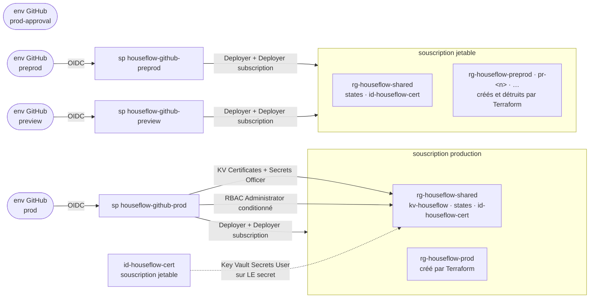

# RBAC HouseFlow — qui a le droit de faire quoi, et où

La frontière est la **souscription**. La production et les environnements jetables vivent dans
deux souscriptions distinctes du même tenant : `sp-prod` n'a aucun rôle dans la souscription
jetable, et ni `sp-preprod` ni `sp-preview` n'en ont dans celle de production. C'est une limite
qu'aucun tag mal posé ni aucun bug de filtre ne peut franchir, là où un découpage en resource
groups supposait que tout le monde vise le bon.

Ce n'est pas un raffinement : depuis qu'un environnement crée et détruit ses propres resource
groups, le rôle qui le permet s'assigne forcément à la souscription. Un service principal capable
de faire `az group delete` dans la souscription de production serait à une erreur de filtre de la
détruire.

Deux mécanismes à ne pas confondre :

- **Federated credential** = une *confiance*. Elle dit quel workflow GitHub peut demander un token
  au nom de cette identité (subject `repo:BarbeRouss/HouseFlow:environment:<env>`). Elle ne donne
  accès à aucune ressource.
- **Role assignment** = un *droit*, posé sur le service principal, à un scope donné.

C'est pourquoi `prod-approval` n'a **ni** app registration **ni** federated credential : c'est une
gate d'approbation humaine, elle n'accède à rien.

## Vue d'ensemble



`prod-approval` n'a aucune flèche : aucune identité, aucun droit, rien qu'une approbation requise.

La seule flèche qui traverse la frontière est en pointillés, et elle va du jetable vers le
permanent : l'identité de certificat de la souscription jetable lit **un secret** dans le coffre
de production. Le sens compte — aucune identité de production n'a quoi que ce soit en face.

## Rôles par scope

| Scope | `sp-prod` | `sp-preprod` | `sp-preview` |
|---|---|---|---|
| souscription **production** | **Deployer** + **Deployer (subscription)** | — | — |
| `rg-houseflow-shared` (production) | `Key Vault Certificates Officer` + `Key Vault Secrets Officer` + `Role Based Access Control Administrator` (conditionné) | — | — |
| conteneur `tfstate` | `Storage Blob Data Contributor` | — | — |
| souscription **jetable** | — | **Deployer** + **Deployer (subscription)** | **Deployer** + **Deployer (subscription)** |
| conteneur `tfstate` (jetable) | — | `Storage Blob Data Contributor` | `Storage Blob Data Contributor` |

`sp-preprod` porte aussi le `reaper.yml` : le workflow tourne sous l'environnement GitHub
`preprod` parce que c'est là que se trouve le droit de supprimer un resource group. Il n'a ainsi
aucun chemin vers la production — même un bug de filtre ne pourrait pas la viser, son token ne
valant rien dans cette souscription.

`Storage Blob Data Contributor` est posé **par conteneur** et jamais sur le compte : les deux
racines Terraform s'authentifient en AAD sur le plan de données (`use_azuread_auth` dans le bloc
`backend`), et le nettoyage du state par `pr-preview.yml` et `reaper.yml` passe par
`az storage blob --auth-mode login`. Aucun de ces chemins ne demande les clés du compte.

## Ce que contient chaque rôle custom

Les JSON versionnés ici sont la source de vérité ; ces tableaux n'en sont qu'un résumé.

### `HouseFlow Deployer` — `houseflow-deployer.role.json`

Tout le plan de gestion d'un environnement HouseFlow, le resource group compris.

| Domaine | Actions |
|---|---|
| Resource groups | `subscriptions/resourceGroups/read`, `/write`, `/delete` |
| Container Apps | `Microsoft.App/*` (apps, environnements, jobs, certificats d'environnement) |
| Static Web Apps | `Microsoft.Web/staticSites/*` |
| PostgreSQL | `Microsoft.DBforPostgreSQL/flexibleServers/*` |
| Observabilité | `Microsoft.OperationalInsights/workspaces/*` |
| Réseau | `virtualNetworks/*`, `privateDnsZones/*`, `networkSecurityGroups/*` |
| Identité | `Microsoft.ManagedIdentity/userAssignedIdentities/*` |
| Key Vault | `vaults/read`, `/write`, `/delete` — **plan de gestion uniquement** |
| Storage | `storageAccounts/read`, `listKeys/action`, `blobServices/containers/*` |
| Divers | `Microsoft.Resources/deployments/*`, `Microsoft.Authorization/locks/*` |

`resourceGroups/write` et `/delete` sont ce qui a changé de nature avec la refonte, et ce qui
impose le scope souscription : le nom du resource group d'un environnement jetable n'est pas
connu avant sa création, donc aucune assignation plus étroite n'est possible. La contrepartie est
assumée, et c'est elle qui justifie les deux souscriptions.

Pas de `Microsoft.Authorization/roleAssignments/write` : une identité de déploiement ne peut pas
s'élargir elle-même. L'unique attribution de rôle de toute l'infrastructure passe par le rôle
conditionné décrit plus bas.

`Microsoft.Network/virtualNetworks/*` couvre `subnets/join/action`, nécessaire à la délégation
des deux subnets au Flexible Server et au Container Apps Environment. Ce droit est désormais sans
danger pour les autres environnements : le VNet appartient à celui qui le crée, et il n'y a aucun
peering entre eux.

> **Pourquoi les rôles Key Vault de `sp-prod` sont séparés et non fusionnés ici.** Ce rôle est
> strictement **plan de gestion** : créer, configurer et détruire le coffre en tant que ressource.
> Importer un certificat ou écrire un secret relève du **plan de données** (`dataActions`), porté
> par les rôles intégrés `Key Vault Certificates Officer` et `Key Vault Secrets Officer`, assignés
> à `sp-prod` sur `rg-houseflow-shared` seulement. Les fusionner aurait deux défauts : la liste
> d'actions d'un rôle intégré est maintenue par Microsoft et suit l'évolution du service, alors
> qu'une copie fige celle du jour ; et comme `HouseFlow Deployer` porte maintenant sur la
> souscription entière, tout coffre créé plus tard dans n'importe quel resource group donnerait
> d'office accès à son contenu.

### `HouseFlow Deployer (subscription)` — `houseflow-deployer-subscription.role.json`

`Microsoft.Web/locations/*/read`, et rien d'autre. Lier le domaine custom d'une Static Web App est
une opération longue dont Azure publie l'état hors resource group : sans ce droit, l'apply échoue
en `AuthorizationFailed` au moment du bind, après avoir créé toutes les ressources.

Le wildcard est délibéré : l'action exacte (`staticSitesOperationStatuses/read`) n'est pas publiée
dans le registre d'opérations du provider et `az role definition create` la refuse
(`InvalidActionOrNotAction`).

Les trois identités en ont besoin, puisque le frontend est une Static Web App partout, production
comprise. Le rôle est en lecture seule.

### `HouseFlow Shared Tenant` — supprimé

Ce rôle décrivait ce qu'un environnement non-prod avait le droit de faire dans
`rg-houseflow-shared`. Il n'a plus d'objet et sa définition a été retirée du dépôt ; si une
assignation subsiste dans le tenant, elle peut être supprimée sans conséquence.

La raison est directe : la racine `environment` ne lit plus le Key Vault par data source. L'URI
du coffre est dérivée de son nom (`TF_VAR_key_vault_name`, alimentée par la variable de dépôt
`KEY_VAULT_NAME`), précisément pour qu'un environnement jetable n'ait aucun droit de plan de
gestion sur le coffre de production — qui vit d'ailleurs dans l'autre souscription, où ce rôle
n'était de toute façon pas assignable.

Les autres besoins qu'il couvrait ont disparu avec le serveur partagé : il n'y a plus de subnet
d'autrui à joindre, plus de serveur PostgreSQL commun à lire, plus d'identité d'environnement
hébergée ailleurs que chez soi. La seule chose que la racine `environment` lit encore dans
`rg-houseflow-shared`, c'est `id-houseflow-cert` — un `userAssignedIdentities/read` que
`HouseFlow Deployer` couvre déjà au scope souscription.

Sur une installation neuve, il n'y a rien à créer : la définition ne fait plus partie du dépôt.

## L'unique attribution de rôle de l'infrastructure

La racine `shared` crée **une** attribution, et c'est la seule de tout le design :

| Identité managée | Rôle | Scope exact |
|---|---|---|
| `id-houseflow-cert` | `Key Vault Secrets User` | le secret `wildcard-houseflow-cloud`, pas le coffre |

Tout tient à cette indirection. Chaque Container Apps Environment attache `id-houseflow-cert`
pour résoudre sa référence Key Vault, au lieu d'utiliser sa propre identité. Si l'identité de
l'environnement devait lire le coffre, il faudrait lui attribuer un rôle **à chaque création** —
donc confier au service principal de déploiement le pouvoir de distribuer des rôles, ce que
`HouseFlow Deployer` refuse délibérément. Un environnement jetable serait alors soit
impossible à créer, soit créé par une identité capable de s'octroyer n'importe quoi.

Une identité, un rôle, attribué une fois. Les environnements n'en héritent que l'usage.

C'est pour poser cette seule attribution que `sp-prod` porte un `Role Based Access Control
Administrator` **conditionné** (ABAC) sur `rg-houseflow-shared`, restreint par condition au seul
`Key Vault Secrets User`. Il ne peut ni s'octroyer Owner, ni promouvoir une autre identité.

L'identité de certificat de la souscription jetable reçoit le même droit sur le même secret, mais
**au bootstrap et à la main** (`docs/azure-setup-guide.md` §5) : aucun stack ne franchit la
frontière des souscriptions.

Le conteneur `db-dumps` n'a plus d'attribution : les identités qui le liraient vivent désormais
dans les resource groups d'environnement, hors de portée de la racine `shared`. C'est #199 qui
tranchera comment un environnement y accède — vraisemblablement par une identité partagée
supplémentaire, sur le modèle de celle du certificat, ce qui demandera d'élargir la condition
ABAC d'autant.

## Identités d'environnement — aucun rôle Azure

`id-houseflow-<nom>` vit dans le resource group de son environnement et n'a **aucune** attribution
RBAC Azure. Son habilitation est ailleurs : elle est administratrice Entra de **son** serveur
PostgreSQL, et de nul autre, et c'est le nom de son rôle PostgreSQL.

C'est ce qui fait disparaître le job `dbtools roles` : il n'existe plus d'identité privilégiée
chargée de créer les rôles des autres environnements, puisqu'aucun environnement ne partage plus
de serveur. La base applicative est créée par Terraform.

## State Terraform — une frontière d'écriture par conteneur

| Souscription | Conteneur | Clés | Écrit par |
|---|---|---|---|
| production | `tfstate` | `environment-prod.tfstate` | `sp-prod` |
| production | `tfstate` | `shared.tfstate` | `sp-prod` |
| jetable | `tfstate` | `environment-preprod.tfstate`, `environment-pr-<n>.tfstate`, … | `sp-preprod`, `sp-preview` |

Le nom du storage account n'est nulle part dans le code : il arrive en `-backend-config` depuis
le secret d'environnement `TFSTATE_STORAGE_ACCOUNT`. Un nom de storage account est unique au
niveau mondial, donc chaque souscription a forcément le sien — ce qui interdit structurellement
qu'un run jetable écrive dans le storage de production, indépendamment de tout RBAC.

Aucune racine ne lit le state d'une autre : il n'y a pas de `terraform_remote_state` dans ce
dépôt, les références croisées passent par des data sources sur des noms fixes.

## Ce qui empêche une PR d'atteindre la prod

La gate `prod-approval` ne protège **rien** à elle seule : c'est un job vide, et les jobs qui
travaillent portent `environment: prod` sans required reviewer. Ce qui protège la production,
c'est la **politique de branche** des environnements — `prod`, `prod-approval` et `preprod`
limités à `main`.

Sans elle, une PR suffirait : sur un événement `pull_request`, GitHub exécute le workflow tel
qu'il est dans la branche de la PR. Un job `environment: prod` ajouté dans cette branche
obtiendrait un token OIDC de subject `repo:BarbeRouss/HouseFlow:environment:prod` — la federated
credential ne contraint que l'environnement, jamais la branche — et partirait sans approbation
avec tous les droits de `sp-prod`. Avec la politique de branche, GitHub refuse de démarrer le job
et ne délivre aucun token.

`preview` reste ouvert à toutes les branches, faute de quoi les previews de PR ne tourneraient
pas. C'est acceptable depuis que `sp-preview` n'a de droits que dans la souscription jetable.

## Ce que la frontière garantit — et ce qu'elle ne garantit pas

**Garanti.** Un run preprod ou preview ne peut rien créer, lire ni détruire dans la souscription
de production : ni resource group, ni state, ni coffre. Il ne peut pas davantage lire une base de
production — `id-houseflow-prod` est la seule administratrice Entra du serveur `psql-houseflow-prod`,
qui est de toute façon dans un VNet auquel rien ne se raccorde depuis l'autre souscription.

**Non garanti, côté jetable.** `sp-preprod` et `sp-preview` partagent une souscription : chacun
peut détruire les environnements de l'autre, et `listKeys` sur le storage de states leur donne
accès à tous les states jetables, qui contiennent `JWT_KEY` et `GHCR_PAT` en clair. C'est assumé —
ces environnements ne portent que des données de démonstration et vivent douze heures.

**Non garanti, côté production.** `sp-prod` est l'identité la plus privilégiée de sa souscription
et n'est contenue par rien d'autre que le pipeline : Deployer au scope souscription lui donne de
quoi détruire ce qu'un lock ne protège pas. C'est précisément pour cela que le seul chemin vers
`sp-prod` passe par un plan publié, lu, puis approuvé sur `prod-approval` — et que l'apply
consomme ce fichier de plan, pas un nouveau.

## Voir l'état réel dans Azure

```powershell
# Les rôles custom d'une souscription et leurs portées
az role definition list --custom-role-only true --query "[?starts_with(roleName,'HouseFlow')].{nom:roleName, scopes:assignableScopes}" -o table

# Tout ce qui est assigné à une identité (--all : sinon les scopes RG sont ignorés)
az role assignment list --all --assignee $APP["prod"] --query "[].{role:roleDefinitionName, scope:scope}" -o table

# Vue par resource group
az role assignment list --resource-group rg-houseflow-shared --query "[].{qui:principalName, role:roleDefinitionName}" -o table
```

Un rôle custom appartient à une souscription : il faut répéter ces commandes après
`az account set --subscription` pour voir l'autre moitié du tableau.

Dans le portail : Abonnements → *la souscription* → Contrôle d'accès (IAM) → onglet **Rôles** pour
les définitions ; le même onglet **Attributions de rôles** sur chaque resource group pour les
assignations. La condition ABAC se lit en cliquant l'assignation → onglet **Condition**.

---

Procédure de création : [`docs/azure-setup-guide.md`](../../docs/azure-setup-guide.md) §2 à §5.
Architecture d'ensemble : [`specs/infrastructure.md`](../../specs/infrastructure.md).
